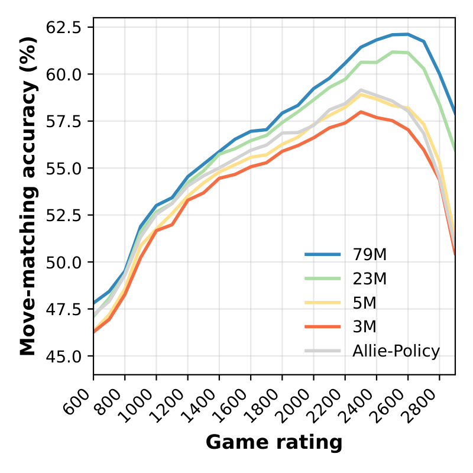

# Maia-3

[](https://arxiv.org/abs/2605.19091)
[](https://huggingface.co/collections/MaiaChess/maia3)

Maia3 is a family of chess transformer models for matching human moves across
skill levels. This repository contains the inference code needed to run the
released Maia3 weights as a UCI chess engine.



Maia3 is built on [Chessformer](https://arxiv.org/abs/2605.19091), a transformer
architecture for chess with Geometric Attention Bias (GAB).

## Install

```bash
git clone https://github.com/CSSLab/maia3.git
cd maia3
python -m pip install .
```

For development, install in editable mode:

```bash
python -m pip install -e .
```

You can also run directly from the repo without installing:

```bash
python -m maia3.uci --help
```

## Quick Start

Run the 79M Maia3 model as a UCI engine:

```bash
maia3-uci --model maia3-79m
```

The first run downloads the checkpoint from Hugging Face and caches it locally.
After that, the same command reuses the cached file.

You can also pass the Hugging Face model URL directly:

```bash
maia3-uci --model https://huggingface.co/UofTCSSLab/Maia3-79M
```

List built-in aliases:

```bash
maia3-uci --list-models
```

## Models

The built-in aliases apply the correct architecture settings automatically.

| Alias | Hugging Face repo | Architecture |
| --- | --- | --- |
| `maia3-3m-ablation` | `UofTCSSLab/Maia3-ablate-3M` | 8 history, 192 dim, 6 heads |
| `maia3-5m` | `UofTCSSLab/Maia3-5M` | 8 history, 256 dim, 8 heads |
| `maia3-23m` | `UofTCSSLab/Maia3-23M` | 8 history, 512 dim, 16 heads |
| `maia3-79m` | `UofTCSSLab/Maia3-79M` | 8 history, 1024 dim, 32 heads |

Short aliases also work:

```bash
maia3-uci --model 3m
maia3-uci --model 5m
maia3-uci --model 23m
maia3-uci --model 79m
```

`maia3-3m` is kept as a compatibility alias for `maia3-3m-ablation`.

If a Hugging Face repository contains more than one checkpoint file, choose one:

```bash
maia3-uci --model UofTCSSLab/Maia3-79M --checkpoint-filename maia3-79m.pt
```

To use a local checkpoint while still applying a built-in config:

```bash
maia3-uci --model maia3-79m --checkpoint-path /path/to/maia3-79m.pt
```

Pass local files with `--checkpoint-path`, not `--model`, so Maia3 knows
whether to use a built-in architecture preset or your custom architecture flags.

To use a fully custom checkpoint, pass the checkpoint and the matching
architecture flags:

```bash
maia3-uci --checkpoint-path /path/to/custom.pt \
  --history 8 --use-padding \
  --dim-vit 256 --head-hid-dim 256 --num-heads 8 \
  --gab-per-square-dim 0 --gab-gen-size 64 --gab-intermediate-dim 64
```

## UCI Options

The engine reads UCI commands from stdin and writes responses to stdout. Any
UCI-aware chess GUI or wrapper can drive it.

User-facing options:

- `Elo`: set both player and opponent Elo.
- `SelfElo`: set the side-to-move Elo.
- `OppoElo`: set the opponent Elo.
- `Temperature`: move sampling temperature. `0` means argmax.
- `TopP`: nucleus sampling threshold. `1.0` disables top-p filtering.

Launch with reconstructed move history:

```bash
maia3-uci --model maia3-79m --use-uci-history
```

Launch on CPU:

```bash
maia3-uci --model maia3-5m --device cpu --no-use-amp
```

By default, Maia3 only loads tensor state-dict checkpoints. If you need to load
an old pickled checkpoint from a source you trust, add `--trust-checkpoint`.

## Example via python-chess

```python
import chess
import chess.engine

eng = chess.engine.SimpleEngine.popen_uci([
    "maia3-uci",
    "--model", "maia3-5m",
    "--use-uci-history",
    "--elo", "1500",
])

board = chess.Board()
print(eng.play(board, limit=chess.engine.Limit(nodes=1)).move)
eng.close()
```

If the `maia3-uci` script is not on your `PATH`, use Python module execution:

```python
import sys

cmd = [sys.executable, "-m", "maia3.uci", "--model", "maia3-5m"]
```

## Legacy Entry Point

The old command still works from the repository root:

```bash
python code/uci.py --model maia3-5m
```

New integrations should prefer `maia3-uci` or `python -m maia3.uci`.

## Paper and Citation

Read the paper here: [Chessformer: A Unified Architecture for Chess Modeling](https://arxiv.org/abs/2605.19091)

```bibtex
@inproceedings{monroe2026chessformer,
title={Chessformer: A Unified Architecture for Chess Modeling},
author={Daniel Monroe and George Eilender and Philip Chalmers and Zhenwei Tang and Ashton Anderson},
booktitle={The Fourteenth International Conference on Learning Representations},
year={2026},
url={https://openreview.net/forum?id=2ltBRzEHyd}
}
```
